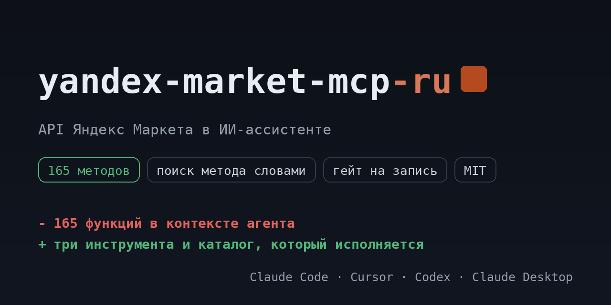

# yandex-market-mcp-ru

<!-- mcp-name: io.github.ilyautov/yandex-market-mcp-ru -->

API Яндекс Маркета (Partner API) для ИИ-ассистентов: заказы и возвраты, товары и карточки, цены и тарифы, отчёты, отзывы и чаты. Каталог исполняется сервером.

[](https://pypi.org/project/yandex-market-mcp-ru/)
[](https://github.com/ilyautov/yandex-market-mcp-ru/actions/workflows/ci.yml)
[](LICENSE)
[](#карта-методов)
[](https://marketplaces-mcp-ru.aifrontier.tech/yandex-market-api.html)
[](https://github.com/ilyautov/yandex-market-mcp-ru/stargazers)

<p align="center">
  <a href="https://marketplaces-mcp-ru.aifrontier.tech/yandex-market-api.html">
    
  </a>
</p>

Пакет поднимает один сервер, Яндекс Маркет, и ничего больше. Сервер, каталог и
ядро приходят зависимостью из [`marketplaces-mcp-ru`](https://github.com/ilyautov/marketplaces-mcp-ru):
здесь имя, точка входа и документация под один маркетплейс.

## Установка

Пакет на PyPI, поэтому строка одна:

```bash
uvx yandex-market-mcp-ru
```

Если нужна ветка `main`, а не релиз:

```bash
uvx --from git+https://github.com/ilyautov/yandex-market-mcp-ru yandex-market-mcp-ru
```

Claude Desktop, `claude_desktop_config.json`:

```json
{
  "mcpServers": {
    "ym": {
      "command": "uvx",
      "args": ["yandex-market-mcp-ru"],
      "env": { "YANDEX_MARKET_API_KEY": "..." }
    }
  }
}
```

Третий путь, если агент умеет скиллы: он поставит сервер и настроит клиент сам.

```bash
npx skills add ilyautov/yandex-market-mcp-ru
```

## Ключи

**Где взять Api-Key.** Кабинет партнёра `partner.market.yandex.ru`, раздел **Настройки**, пункт **Доступ к API**. Ключ уходит в заголовок `Api-Key`, хост `api.partner.market.yandex.ru`.

**Бизнес и кампания это разные идентификаторы.** Часть методов адресуется идентификатором бизнеса, часть номером кампании (магазина). Подставить один вместо другого даёт не ошибку доступа, а пустой ответ, что путает сильнее.

**Где он лежит.** В `~/.marketplace-mcp/cabinets.json` с правами `chmod 600`, локально.

| переменная | секрет | что это |
|---|---|---|
| `YANDEX_MARKET_API_KEY` | да | API-ключ из кабинета партнёра, раздел Настройки → API. |

Ключи можно не держать в окружении: сервер умеет кабинеты и кладёт их в
`~/.marketplace-mcp/cabinets.json` с правами 600, вне репозитория. Магазинов
подключается сколько нужно, переключение прямо из чата.

## Карта методов

Каталог лежит в зависимости как `yandex_mcp/endpoints.yaml`:
**165 методов**, из них 109 на чтение, 49 на запись и 7 необратимых.
Сервер исполняет ровно этот файл, поэтому таблица не может разойтись с кодом.

| тема | методов | чтение | запись | необратимые |
|---|---:|---:|---:|---:|
| Заказы, возвраты и невыкупы | 38 | 19 | 19 | 0 |
| Отчёты | 27 | 27 | 0 | 0 |
| Товары и карточки | 22 | 11 | 8 | 3 |
| Отгрузки, поставки и склады | 21 | 15 | 6 | 0 |
| Отзывы, вопросы и чаты | 18 | 11 | 6 | 1 |
| Самовывоз и регионы доставки | 15 | 10 | 3 | 2 |
| Цены, тарифы и карантин | 10 | 6 | 4 | 0 |
| Продвижение и реклама | 8 | 4 | 3 | 1 |
| Кабинет и служебное | 6 | 6 | 0 | 0 |

Подробный разбор с параметрами и лимитами: [https://marketplaces-mcp-ru.aifrontier.tech/yandex-market-api.html](https://marketplaces-mcp-ru.aifrontier.tech/yandex-market-api.html)

## Что спросить в чате

- покажи заказы на Яндекс Маркете за неделю
- какой у меня индекс качества и что его роняет
- собери отчёт по продажам за месяц
- покажи товары в карантине цен

## Частые ошибки

**Пустой ответ вместо данных.** Чаще всего перепутаны идентификатор бизнеса и номер кампании. Ошибки доступа при этом не будет, ответ придёт корректный и пустой.

**Ошибка в имени поля.** Каталог методов собран из официального OpenAPI-документа, а живой прогон на реальных кабинетах ещё не делался. Неточности в именах полей возможны. `describe_method` покажет схему, `call_raw` даст поправить запрос на месте.

**Метод не находится по названию.** Ищите по теме, а не по имени: спросите агента «что ты умеешь по Яндекс Маркету», он покажет разделы и подберёт метод сам.

## Чем это отличается от marketplaces-mcp-ru

Ничем, кроме состава. `marketplaces-mcp-ru` ставит четыре маркетплейса сразу и держит их
под одним сервером, `yandex-market-mcp-ru` ставит один. Код общий: правка в ядре доезжает
сюда обновлением зависимости, а не копированием.

| нужно | пакет |
|---|---|
| только Яндекс Маркет | `yandex-market-mcp-ru` |
| все четыре маркетплейса | `marketplaces-mcp-ru` |

## Кто это сделал

[Илья Утов](https://github.com/ilyautov), лаборатория
[AI Frontier](https://aifrontier.tech). Как эти инструменты устроены внутри,
пишу в [Telegram](https://t.me/gorilla_under_hood) и
[LinkedIn](https://www.linkedin.com/in/ilyautov).

Рядом стоят [**business-mcp-ru**](https://github.com/ilyautov/business-mcp-ru)
(hh.ru, VK, Диадок, СБИС, Честный знак),
[**moysklad-mcp-ru**](https://github.com/ilyautov/moysklad-mcp-ru) и
[**humanizer-ru**](https://github.com/ilyautov/humanizer-ru).

## Лицензия

MIT, см. [LICENSE](LICENSE).
